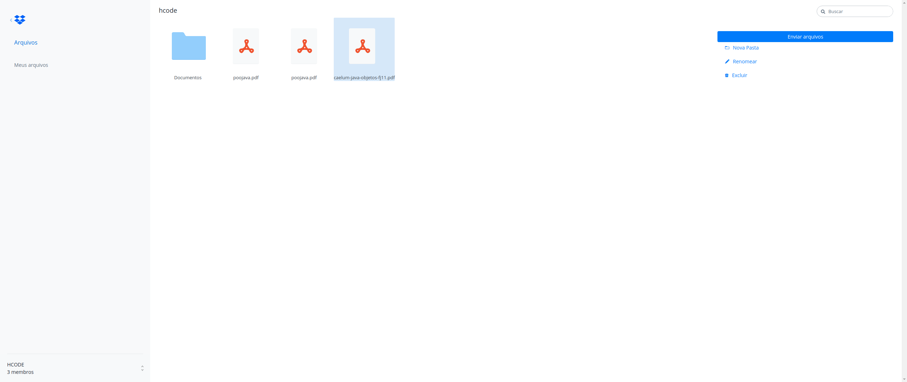

# Dropbox clone

Esse projeto possui as principais funcionalidades do serviço dropbox, ou seja, Envio, leitura, renomeação e exclusão de arquivos.

## Para reproduzir suas funcionalidades em localhost .

1- clone o projeto para uma pasta local de sua escolha.

2- acesse essa pasta com o editor de arquivos de sua preferencia.

3- com o projeto aberto no editor, execute o comando nodemon server.js

4- acesse em seu navegador a rota localhost:3333

5- depois de feito todos os passos só falta testar :)

## Funcionalidades

- Criação de diretórios.
- Envio de arquivos, salvos em disco e referenciados através do firebase realtime.
- Renomeação de arquivos.
- Exclusão de arquivos.
